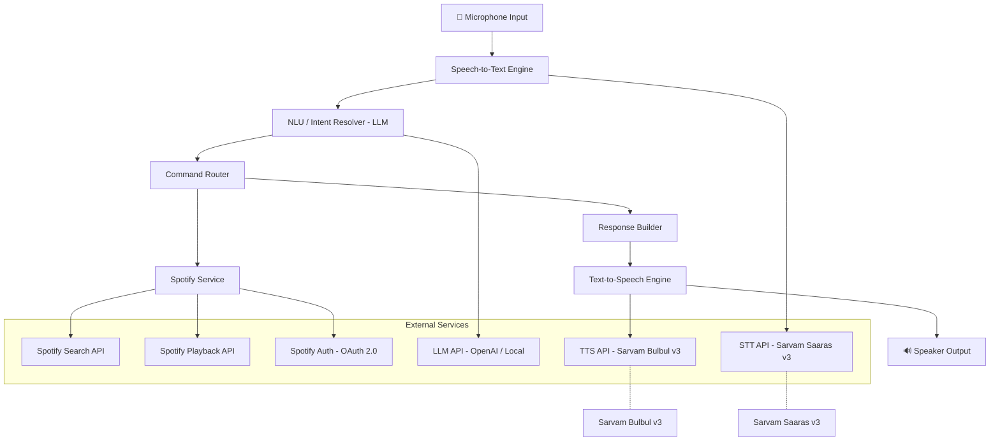
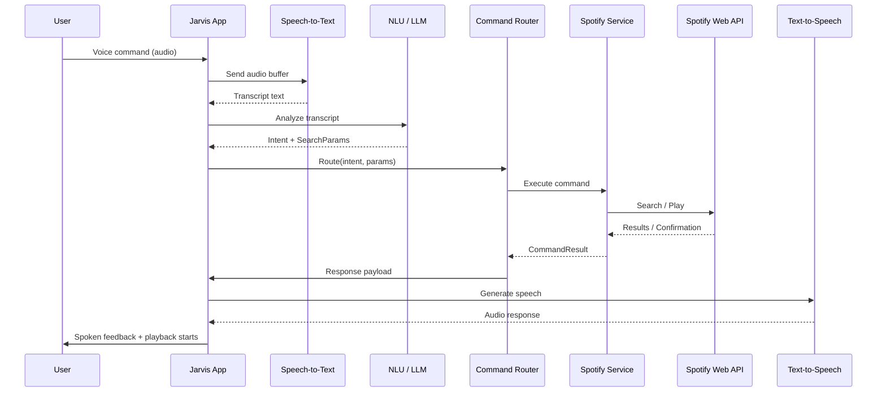
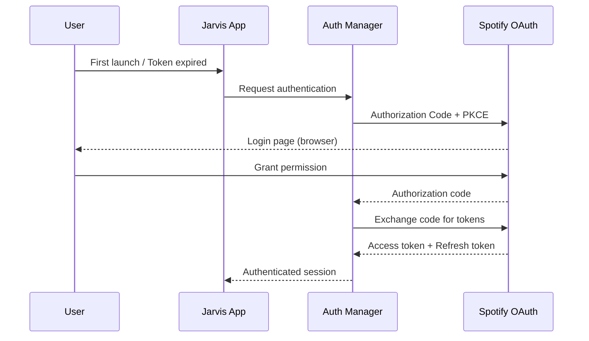
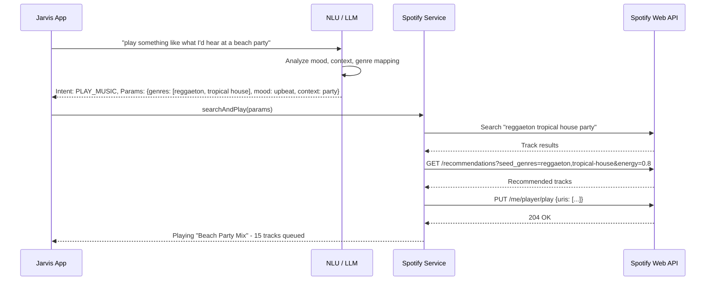

# Design Document: Jarvis Voice Assistant (Spotify MVP)

## Overview

Jarvis is a voice-controlled assistant that takes natural language voice commands and translates them into Spotify actions. The MVP focuses on understanding complex, vague, or contextual music requests — such as "play something chill for a rainy afternoon" or "play that one song from the 90s about heartbreak" — and converting them into effective Spotify search queries.

The system captures audio from the phone's microphone, transcribes it via a speech-to-text engine, passes the transcript through a natural language understanding (NLU) layer powered by an LLM to extract intent and search parameters, queries the Spotify Web API, and initiates playback on the user's active Spotify device. A text-to-speech (TTS) engine provides spoken feedback to the user.

The app is built as a .NET MAUI mobile application, running natively on iOS/Android. It captures audio from the phone's microphone, processes the full pipeline on-device (calling cloud APIs for STT, LLM, and TTS), and controls Spotify playback. The architecture is designed as a pipeline: Voice Input → STT (Sarvam Saaras v3) → NLU/Intent Resolution (LLM) → Spotify API → Playback Control → TTS Response (Sarvam Bulbul v3). Each stage is a discrete component with clear interfaces, making the system testable and extensible for future integrations beyond Spotify.

## Architecture



## Sequence Diagrams

### Main Voice Command Flow



### Spotify OAuth Flow



### Complex Query Resolution Flow



## Components and Interfaces

### Component 1: SpeechToTextEngine

**Purpose**: Captures audio from the microphone and converts it to text transcripts.

```pascal
INTERFACE SpeechToTextEngine
  PROCEDURE transcribe(audioBuffer: AudioBuffer) -> TranscriptResult
  PROCEDURE startListening() -> AudioStream
  PROCEDURE stopListening() -> VOID
  FUNCTION isListening() -> Boolean
END INTERFACE
```

**Responsibilities**:
- Capture audio from device microphone
- Stream or batch audio to STT provider (Sarvam Saaras v3 API)
- Return transcript with confidence score
- Handle silence detection and auto-stop

### Component 2: NLUResolver (Intent & Search Parameter Extraction)

**Purpose**: Takes raw transcript text and uses an LLM to extract structured intent and search parameters. This is the core intelligence layer.

```pascal
INTERFACE NLUResolver
  PROCEDURE resolveIntent(transcript: String, conversationHistory: List<Turn>) -> IntentResult
END INTERFACE
```

**Responsibilities**:
- Map natural language to structured intents (PLAY_MUSIC, PAUSE, SKIP, etc.)
- Extract explicit parameters (artist name, song title, album)
- Infer implicit parameters from vague prompts (mood, genre, era, context)
- Maintain conversation context for follow-up commands ("play more like that")

### Component 3: CommandRouter

**Purpose**: Routes resolved intents to the appropriate service handler.

```pascal
INTERFACE CommandRouter
  PROCEDURE route(intent: IntentResult) -> CommandResult
  PROCEDURE registerHandler(intentType: IntentType, handler: CommandHandler) -> VOID
END INTERFACE
```

**Responsibilities**:
- Map intent types to handler functions
- Validate intent parameters before dispatching
- Return unified CommandResult regardless of handler

### Component 4: SpotifyService

**Purpose**: Interfaces with the Spotify Web API for search, playback, and recommendations.

```pascal
INTERFACE SpotifyService
  PROCEDURE search(params: SearchParams) -> List<Track>
  PROCEDURE play(tracks: List<Track>, deviceId: String) -> PlaybackResult
  PROCEDURE pause() -> PlaybackResult
  PROCEDURE skip() -> PlaybackResult
  PROCEDURE getRecommendations(seeds: RecommendationSeeds) -> List<Track>
  PROCEDURE getActiveDevice() -> Device
  FUNCTION isAuthenticated() -> Boolean
END INTERFACE
```

**Responsibilities**:
- Authenticate via OAuth 2.0 with PKCE
- Translate SearchParams into Spotify API query strings
- Combine search results with recommendation API for vague queries
- Manage playback state on user's active device
- Handle token refresh transparently

### Component 5: AuthManager

**Purpose**: Manages Spotify OAuth 2.0 authentication lifecycle.

```pascal
INTERFACE AuthManager
  PROCEDURE authenticate() -> AuthSession
  PROCEDURE refreshToken(session: AuthSession) -> AuthSession
  PROCEDURE getValidToken() -> String
  FUNCTION isSessionValid() -> Boolean
END INTERFACE
```

**Responsibilities**:
- Implement OAuth 2.0 Authorization Code with PKCE flow
- Securely store tokens (keychain / secure storage)
- Auto-refresh expired access tokens
- Handle re-authentication when refresh token expires

### Component 6: ResponseBuilder & TTS

**Purpose**: Constructs natural language responses and converts them to speech.

```pascal
INTERFACE ResponseBuilder
  PROCEDURE buildResponse(commandResult: CommandResult) -> String
END INTERFACE

INTERFACE TextToSpeechEngine
  PROCEDURE speak(text: String) -> AudioBuffer
  PROCEDURE setVoice(voiceId: String) -> VOID
END INTERFACE
```

**Responsibilities**:
- Generate conversational confirmation messages ("Now playing Bohemian Rhapsody by Queen")
- Handle error messages gracefully ("I couldn't find that song, want me to try something similar?")
- Convert text responses to spoken audio

## Data Models

### IntentResult

```pascal
STRUCTURE IntentResult
  intentType: IntentType
  confidence: Float          -- 0.0 to 1.0
  searchParams: SearchParams -- NULL if not a search intent
  rawTranscript: String
END STRUCTURE

ENUMERATION IntentType
  PLAY_MUSIC
  PAUSE
  RESUME
  SKIP_NEXT
  SKIP_PREVIOUS
  SET_VOLUME
  GET_NOW_PLAYING
  PLAY_MORE_LIKE_THIS
  UNKNOWN
END ENUMERATION
```

**Validation Rules**:
- confidence must be between 0.0 and 1.0
- searchParams is required when intentType is PLAY_MUSIC or PLAY_MORE_LIKE_THIS
- intentType UNKNOWN triggers a clarification response

### SearchParams

```pascal
STRUCTURE SearchParams
  query: String              -- Direct search query if explicit
  artist: String             -- NULL if not specified
  track: String              -- NULL if not specified
  album: String              -- NULL if not specified
  genres: List<String>       -- Inferred genres (e.g., ["indie", "rock"])
  mood: String               -- Inferred mood (e.g., "chill", "energetic")
  era: String                -- Inferred era (e.g., "90s", "2010s")
  context: String            -- Situational context (e.g., "workout", "study")
  energy: Float              -- 0.0 to 1.0, maps to Spotify audio features
  isVague: Boolean           -- TRUE if query requires recommendation API
END STRUCTURE
```

**Validation Rules**:
- At least one of query, artist, track, genres, or mood must be non-null
- energy must be between 0.0 and 1.0 if provided
- isVague is TRUE when no explicit artist/track/album is provided

### Track & PlaybackResult

```pascal
STRUCTURE Track
  id: String
  name: String
  artist: String
  album: String
  uri: String                -- Spotify URI (spotify:track:xxx)
  durationMs: Integer
END STRUCTURE

STRUCTURE PlaybackResult
  success: Boolean
  message: String
  nowPlaying: Track          -- NULL if paused/stopped
  queueLength: Integer
END STRUCTURE

STRUCTURE CommandResult
  success: Boolean
  message: String
  data: ANY                  -- Flexible payload per intent type
END STRUCTURE
```

### ConversationTurn

```pascal
STRUCTURE Turn
  role: String               -- "user" or "assistant"
  content: String
  timestamp: DateTime
  intent: IntentResult       -- NULL for assistant turns
END STRUCTURE
```


## Algorithmic Pseudocode

### Main Voice Command Pipeline

```pascal
ALGORITHM processVoiceCommand(audioInput)
INPUT: audioInput of type AudioBuffer
OUTPUT: result of type CommandResult

BEGIN
  -- Precondition: audioInput is non-empty and contains valid audio data
  ASSERT audioInput IS NOT NULL
  ASSERT audioInput.duration > 0

  -- Step 1: Transcribe audio to text
  transcript ← SpeechToTextEngine.transcribe(audioInput)

  IF transcript.confidence < CONFIDENCE_THRESHOLD THEN
    RETURN CommandResult(false, "I didn't catch that. Could you say it again?", NULL)
  END IF

  -- Step 2: Resolve intent via LLM
  conversationHistory ← ConversationStore.getRecentTurns(MAX_CONTEXT_TURNS)
  intentResult ← NLUResolver.resolveIntent(transcript.text, conversationHistory)

  IF intentResult.intentType = UNKNOWN THEN
    RETURN CommandResult(false, "I'm not sure what you mean. Could you rephrase?", NULL)
  END IF

  -- Step 3: Route to appropriate handler
  commandResult ← CommandRouter.route(intentResult)

  -- Step 4: Store conversation turn
  ConversationStore.addTurn("user", transcript.text, intentResult)
  ConversationStore.addTurn("assistant", commandResult.message, NULL)

  -- Step 5: Speak response
  responseText ← ResponseBuilder.buildResponse(commandResult)
  TextToSpeechEngine.speak(responseText)

  -- Postcondition: result is a valid CommandResult
  ASSERT commandResult IS NOT NULL
  ASSERT commandResult.message IS NOT EMPTY

  RETURN commandResult
END
```

**Preconditions:**
- audioInput is non-null and contains valid PCM/WAV audio data
- Audio duration is greater than 0 seconds
- STT engine, NLU resolver, and Spotify service are initialized

**Postconditions:**
- Returns a valid CommandResult with success status and message
- Conversation history is updated with the user turn and assistant response
- If successful, Spotify playback state has been modified accordingly

**Loop Invariants:** N/A (pipeline, no loops)

---

### NLU Intent Resolution Algorithm

```pascal
ALGORITHM resolveIntent(transcript, conversationHistory)
INPUT: transcript of type String, conversationHistory of type List<Turn>
OUTPUT: intentResult of type IntentResult

BEGIN
  ASSERT transcript IS NOT EMPTY

  -- Build LLM prompt with system instructions and conversation context
  systemPrompt ← buildSystemPrompt()
  contextMessages ← formatConversationHistory(conversationHistory)

  userMessage ← "User said: " + transcript + "\n"
    + "Extract the intent and search parameters as JSON."

  -- Call LLM with structured output
  llmResponse ← LLM.chat(systemPrompt, contextMessages, userMessage)

  -- Parse structured response
  parsed ← JSON.parse(llmResponse)

  intentResult ← IntentResult(
    intentType: mapToIntentType(parsed.intent),
    confidence: parsed.confidence,
    searchParams: buildSearchParams(parsed),
    rawTranscript: transcript
  )

  -- Handle follow-up context ("play more like that")
  IF intentResult.intentType = PLAY_MORE_LIKE_THIS THEN
    lastPlayedTrack ← ConversationStore.getLastPlayedTrack()
    IF lastPlayedTrack IS NOT NULL THEN
      intentResult.searchParams.seedTrackId ← lastPlayedTrack.id
    END IF
  END IF

  ASSERT intentResult.intentType IS NOT NULL
  ASSERT intentResult.confidence >= 0.0 AND intentResult.confidence <= 1.0

  RETURN intentResult
END
```

**Preconditions:**
- transcript is a non-empty string
- LLM API is reachable and configured
- conversationHistory contains valid Turn objects (may be empty)

**Postconditions:**
- Returns IntentResult with valid intentType and confidence
- searchParams is populated when intentType is PLAY_MUSIC or PLAY_MORE_LIKE_THIS
- Follow-up intents are enriched with context from conversation history

**Loop Invariants:** N/A

---

### LLM System Prompt Construction

```pascal
ALGORITHM buildSystemPrompt()
OUTPUT: systemPrompt of type String

BEGIN
  systemPrompt ← "You are Jarvis, a music assistant. "
    + "Given a user's voice command, extract:\n"
    + "1. intent: one of [PLAY_MUSIC, PAUSE, RESUME, SKIP_NEXT, SKIP_PREVIOUS, "
    + "SET_VOLUME, GET_NOW_PLAYING, PLAY_MORE_LIKE_THIS, UNKNOWN]\n"
    + "2. confidence: float 0.0-1.0\n"
    + "3. searchParams (if PLAY_MUSIC):\n"
    + "   - query: direct search string\n"
    + "   - artist, track, album: if explicitly named\n"
    + "   - genres: inferred genre list\n"
    + "   - mood: inferred mood (chill, energetic, melancholy, upbeat, etc.)\n"
    + "   - era: decade if mentioned or implied\n"
    + "   - context: situational context (workout, study, party, driving, etc.)\n"
    + "   - energy: 0.0-1.0 mapping to energy level\n"
    + "   - isVague: true if no explicit artist/track/album\n\n"
    + "For vague requests like 'play something chill' or 'play beach vibes', "
    + "infer genres, mood, and energy. Be creative but accurate.\n"
    + "Respond ONLY with valid JSON."

  RETURN systemPrompt
END
```

---

### Spotify Search and Play Algorithm

```pascal
ALGORITHM searchAndPlay(searchParams)
INPUT: searchParams of type SearchParams
OUTPUT: playbackResult of type PlaybackResult

BEGIN
  ASSERT searchParams IS NOT NULL
  ASSERT AuthManager.isSessionValid() = TRUE

  tracks ← EMPTY LIST

  -- Strategy 1: Direct search for explicit queries
  IF searchParams.isVague = FALSE THEN
    queryString ← buildDirectQuery(searchParams)
    tracks ← SpotifyService.search(queryString, limit: 10)
  END IF

  -- Strategy 2: Recommendation API for vague queries
  IF searchParams.isVague = TRUE OR LENGTH(tracks) = 0 THEN
    seeds ← RecommendationSeeds(
      seedGenres: searchParams.genres,
      targetEnergy: searchParams.energy,
      targetValence: moodToValence(searchParams.mood)
    )

    -- If we have some tracks from search, use them as seed tracks
    IF LENGTH(tracks) > 0 THEN
      seeds.seedTracks ← FIRST(tracks, 2).ids
    END IF

    recommendedTracks ← SpotifyService.getRecommendations(seeds)
    tracks ← MERGE(tracks, recommendedTracks)
  END IF

  -- No results found
  IF LENGTH(tracks) = 0 THEN
    RETURN PlaybackResult(false, "I couldn't find anything matching that. Try being more specific?", NULL, 0)
  END IF

  -- Start playback on active device
  device ← SpotifyService.getActiveDevice()

  IF device IS NULL THEN
    RETURN PlaybackResult(false, "No active Spotify device found. Open Spotify on your phone first.", NULL, 0)
  END IF

  SpotifyService.play(tracks, device.id)

  RETURN PlaybackResult(
    success: TRUE,
    message: "Now playing " + tracks[0].name + " by " + tracks[0].artist,
    nowPlaying: tracks[0],
    queueLength: LENGTH(tracks)
  )
END
```

**Preconditions:**
- searchParams is non-null with at least one search criterion populated
- User is authenticated with a valid Spotify access token
- At least one active Spotify device is available (for playback)

**Postconditions:**
- If successful: playback has started on the user's active device, result contains nowPlaying track
- If no results: returns failure with helpful message, no playback state changed
- If no device: returns failure with device activation instructions

**Loop Invariants:** N/A

---

### Direct Query Builder

```pascal
ALGORITHM buildDirectQuery(searchParams)
INPUT: searchParams of type SearchParams
OUTPUT: queryString of type String

BEGIN
  parts ← EMPTY LIST

  IF searchParams.track IS NOT NULL THEN
    APPEND "track:" + searchParams.track TO parts
  END IF

  IF searchParams.artist IS NOT NULL THEN
    APPEND "artist:" + searchParams.artist TO parts
  END IF

  IF searchParams.album IS NOT NULL THEN
    APPEND "album:" + searchParams.album TO parts
  END IF

  IF LENGTH(parts) > 0 THEN
    RETURN JOIN(parts, " ")
  END IF

  -- Fallback to raw query with genre/mood hints
  IF searchParams.query IS NOT NULL THEN
    RETURN searchParams.query
  END IF

  -- Build from inferred attributes
  queryParts ← EMPTY LIST
  IF searchParams.genres IS NOT EMPTY THEN
    APPEND JOIN(searchParams.genres, " ") TO queryParts
  END IF
  IF searchParams.mood IS NOT NULL THEN
    APPEND searchParams.mood TO queryParts
  END IF
  IF searchParams.context IS NOT NULL THEN
    APPEND searchParams.context TO queryParts
  END IF

  RETURN JOIN(queryParts, " ")
END
```

---

### Mood to Valence Mapping

```pascal
ALGORITHM moodToValence(mood)
INPUT: mood of type String
OUTPUT: valence of type Float (0.0 to 1.0)

BEGIN
  IF mood IS NULL THEN
    RETURN 0.5  -- neutral default
  END IF

  moodMap ← {
    "happy": 0.9,
    "upbeat": 0.85,
    "energetic": 0.8,
    "party": 0.85,
    "chill": 0.5,
    "relaxed": 0.45,
    "mellow": 0.4,
    "melancholy": 0.2,
    "sad": 0.15,
    "angry": 0.3,
    "dark": 0.2,
    "romantic": 0.6,
    "nostalgic": 0.45,
    "focused": 0.4,
    "epic": 0.75
  }

  normalizedMood ← LOWERCASE(mood)

  IF normalizedMood IN moodMap THEN
    RETURN moodMap[normalizedMood]
  ELSE
    RETURN 0.5  -- default for unknown moods
  END IF
END
```

**Preconditions:**
- mood is a string or NULL

**Postconditions:**
- Returns a float between 0.0 and 1.0
- Known moods return their mapped valence
- Unknown moods return 0.5 (neutral)

**Loop Invariants:** N/A


## Key Functions with Formal Specifications

### Function 1: processVoiceCommand()

```pascal
PROCEDURE processVoiceCommand(audioInput: AudioBuffer) -> CommandResult
```

**Preconditions:**
- `audioInput` is non-null with duration > 0
- All pipeline services (STT, NLU, Spotify, TTS) are initialized
- Network connectivity is available

**Postconditions:**
- Returns valid CommandResult with success boolean and message string
- Conversation history is updated with user and assistant turns
- On success: Spotify playback state is modified per intent
- On failure: no side effects on Spotify playback state

**Loop Invariants:** N/A

### Function 2: resolveIntent()

```pascal
PROCEDURE resolveIntent(transcript: String, history: List<Turn>) -> IntentResult
```

**Preconditions:**
- `transcript` is a non-empty string
- `history` contains 0 or more valid Turn objects
- LLM API is reachable

**Postconditions:**
- Returns IntentResult with intentType ∈ IntentType enumeration
- `confidence` is in range [0.0, 1.0]
- If intentType is PLAY_MUSIC: searchParams is non-null with at least one criterion
- If intentType is PLAY_MORE_LIKE_THIS: searchParams includes seed from last played track (if available)

**Loop Invariants:** N/A

### Function 3: searchAndPlay()

```pascal
PROCEDURE searchAndPlay(params: SearchParams) -> PlaybackResult
```

**Preconditions:**
- `params` is non-null with at least one search criterion
- Spotify session is authenticated with valid access token
- User has Spotify Premium (required for playback control)

**Postconditions:**
- If tracks found and device active: playback starts, returns success with nowPlaying
- If no tracks found: returns failure, no playback state change
- If no active device: returns failure with device activation message
- `queueLength` reflects actual number of tracks queued

**Loop Invariants:** N/A

### Function 4: buildDirectQuery()

```pascal
FUNCTION buildDirectQuery(params: SearchParams) -> String
```

**Preconditions:**
- `params` is non-null

**Postconditions:**
- Returns non-empty string suitable for Spotify search API `q` parameter
- Explicit fields (track, artist, album) use Spotify field filter syntax
- If no explicit fields: falls back to query string or inferred attributes
- No side effects

**Loop Invariants:** N/A

### Function 5: moodToValence()

```pascal
FUNCTION moodToValence(mood: String) -> Float
```

**Preconditions:**
- `mood` is a string or NULL

**Postconditions:**
- Returns float in range [0.0, 1.0]
- Known moods map to predefined valence values
- NULL or unknown moods return 0.5

**Loop Invariants:** N/A

## Example Usage

### Example 1: Explicit Song Request

```pascal
SEQUENCE
  -- User says: "Play Bohemian Rhapsody by Queen"
  audio ← Microphone.capture()
  transcript ← STT.transcribe(audio)
  -- transcript.text = "Play Bohemian Rhapsody by Queen"

  intent ← NLU.resolveIntent(transcript.text, [])
  -- intent.intentType = PLAY_MUSIC
  -- intent.searchParams.track = "Bohemian Rhapsody"
  -- intent.searchParams.artist = "Queen"
  -- intent.searchParams.isVague = FALSE

  result ← searchAndPlay(intent.searchParams)
  -- result.success = TRUE
  -- result.message = "Now playing Bohemian Rhapsody by Queen"

  TTS.speak(result.message)
END SEQUENCE
```

### Example 2: Vague / Mood-Based Request

```pascal
SEQUENCE
  -- User says: "Play something chill for studying"
  audio ← Microphone.capture()
  transcript ← STT.transcribe(audio)
  -- transcript.text = "Play something chill for studying"

  intent ← NLU.resolveIntent(transcript.text, [])
  -- intent.intentType = PLAY_MUSIC
  -- intent.searchParams.query = NULL
  -- intent.searchParams.genres = ["lo-fi", "ambient", "chillhop"]
  -- intent.searchParams.mood = "chill"
  -- intent.searchParams.context = "study"
  -- intent.searchParams.energy = 0.3
  -- intent.searchParams.isVague = TRUE

  result ← searchAndPlay(intent.searchParams)
  -- Uses Spotify Recommendations API with seed_genres and target_energy
  -- result.message = "Now playing Chill Lo-Fi Study Beats - 20 tracks queued"

  TTS.speak(result.message)
END SEQUENCE
```

### Example 3: Follow-Up Command

```pascal
SEQUENCE
  -- Previous: played "Bohemian Rhapsody" by Queen
  -- User says: "Play more like that"

  audio ← Microphone.capture()
  transcript ← STT.transcribe(audio)

  history ← ConversationStore.getRecentTurns(5)
  intent ← NLU.resolveIntent(transcript.text, history)
  -- intent.intentType = PLAY_MORE_LIKE_THIS
  -- intent.searchParams.seedTrackId = "spotify:track:xxx" (from last played)

  result ← searchAndPlay(intent.searchParams)
  -- Uses Recommendations API with seed_tracks
  -- result.message = "Playing similar tracks to Bohemian Rhapsody"

  TTS.speak(result.message)
END SEQUENCE
```

### Example 4: Playback Control

```pascal
SEQUENCE
  -- User says: "Pause" or "Skip this song"
  audio ← Microphone.capture()
  transcript ← STT.transcribe(audio)

  intent ← NLU.resolveIntent(transcript.text, [])
  -- intent.intentType = PAUSE (or SKIP_NEXT)

  result ← CommandRouter.route(intent)
  -- Calls SpotifyService.pause() or SpotifyService.skip()

  TTS.speak(result.message)
  -- "Paused." or "Skipping to next track."
END SEQUENCE
```

## Correctness Properties

*A property is a characteristic or behavior that should hold true across all valid executions of a system — essentially, a formal statement about what the system should do. Properties serve as the bridge between human-readable specifications and machine-verifiable correctness guarantees.*

### Property 1: Low-confidence transcripts produce retry without side effects

*For any* transcript result with confidence below the Confidence_Threshold, the pipeline should return a retry message and leave the Spotify playback state unchanged.

**Validates: Requirements 1.2, 10.4**

### Property 2: Intent resolution returns valid intent type and bounded confidence

*For any* non-empty transcript string, resolveIntent should return an IntentResult with an intentType from the IntentType enumeration and a confidence score in the range [0.0, 1.0].

**Validates: Requirements 2.1**

### Property 3: PLAY_MUSIC intent always has populated search params

*For any* IntentResult with intentType PLAY_MUSIC, the searchParams field should be non-null and contain at least one populated search criterion (query, artist, track, genres, or mood).

**Validates: Requirements 2.5**

### Property 4: UNKNOWN intent produces clarification response

*For any* IntentResult with intentType UNKNOWN, the pipeline should produce a CommandResult with a clarification message and not modify Spotify playback state.

**Validates: Requirements 2.4**

### Property 5: Conversation history grows by two per command

*For any* successfully processed voice command, the conversation history length should increase by exactly 2 (one user turn and one assistant turn).

**Validates: Requirements 3.1**

### Property 6: PLAY_MORE_LIKE_THIS enriches with seed track

*For any* PLAY_MORE_LIKE_THIS intent where conversation history contains a previously played track, the resulting SearchParams should include the seed track ID from the last played track.

**Validates: Requirements 3.2**

### Property 7: Non-vague queries use field filter syntax in query construction

*For any* SearchParams with isVague set to FALSE and at least one explicit field (track, artist, or album), buildDirectQuery should produce a query string containing the corresponding Spotify field filter syntax (e.g., "track:X", "artist:Y").

**Validates: Requirements 4.1, 5.1**

### Property 8: Empty search results trigger recommendation fallback

*For any* SearchParams where the direct search returns zero results, the system should fall back to the Spotify Recommendations API using inferred attributes before returning a failure.

**Validates: Requirements 4.3**

### Property 9: Query builder always produces non-empty strings

*For any* SearchParams with at least one populated criterion (query, artist, track, album, genres, mood, or context), buildDirectQuery should return a non-empty string.

**Validates: Requirements 5.4**

### Property 10: Mood-to-valence mapping is bounded

*For any* mood string (including NULL and unrecognized values), moodToValence should return a float in the range [0.0, 1.0], with NULL and unknown moods returning 0.5.

**Validates: Requirements 6.1, 6.2**

### Property 11: Command routing returns unified CommandResult

*For any* intent type routed through the Command_Router, the result should be a valid CommandResult with a non-null success boolean and a non-empty message string.

**Validates: Requirements 7.5**

### Property 12: Response builder produces non-empty output for all results

*For any* CommandResult (success or failure), the Response_Builder should generate a non-empty response string.

**Validates: Requirements 8.1, 8.2**

### Property 13: Token refresh on expiry is transparent

*For any* Spotify API call where the access token is expired, the Auth_Manager should automatically refresh the token and retry the request so the caller never receives an authentication error for expired tokens.

**Validates: Requirements 9.2, 10.2**

### Property 14: Failed searches preserve playback state

*For any* search that produces no results, the current Spotify playback state should remain unchanged.

**Validates: Requirements 10.4**

### Property 15: LLM response validation rejects malformed input

*For any* LLM response string that does not conform to the expected JSON schema, the validator should reject it and prevent it from being parsed into an IntentResult.

**Validates: Requirements 11.3**

### Property 16: Rate limiting enforces command cap

*For any* sequence of voice commands exceeding 30 within a one-minute window, the system should reject commands beyond the limit.

**Validates: Requirements 11.4**

## Error Handling

### Error Scenario 1: Speech Recognition Failure

**Condition**: STT returns transcript with confidence below threshold (< 0.4)
**Response**: Return friendly message asking user to repeat
**Recovery**: User speaks again; no state change occurs

### Error Scenario 2: LLM API Unavailable

**Condition**: LLM API call times out or returns error
**Response**: Return error message suggesting user try again
**Recovery**: Retry with exponential backoff (max 3 attempts). If all fail, suggest checking network.

### Error Scenario 3: Spotify Token Expired

**Condition**: Spotify API returns 401 Unauthorized
**Response**: Transparent to user — auto-refresh token and retry
**Recovery**: AuthManager.refreshToken() called automatically. If refresh token also expired, prompt user to re-authenticate.

### Error Scenario 4: No Active Spotify Device

**Condition**: No device returned from Spotify /me/player/devices
**Response**: "No active Spotify device found. Open Spotify on your phone and try again."
**Recovery**: User opens Spotify app; next command will detect the device.

### Error Scenario 5: No Search Results

**Condition**: Both search and recommendations return empty results
**Response**: "I couldn't find anything matching that. Could you try describing it differently?"
**Recovery**: User rephrases; NLU generates different search parameters.

### Error Scenario 6: Spotify Premium Required

**Condition**: Playback control returns 403 (free tier user)
**Response**: "Playback control requires Spotify Premium. I can still search for songs though."
**Recovery**: Degrade gracefully — search works, playback control disabled.

## Testing Strategy

### Unit Testing Approach

- Test NLU prompt construction with various transcript inputs
- Test buildDirectQuery with all combinations of SearchParams fields
- Test moodToValence mapping for all known moods and edge cases (NULL, empty, unknown)
- Test IntentResult validation (confidence bounds, required fields per intent type)
- Test CommandRouter dispatches to correct handler for each IntentType
- Mock all external APIs (LLM, Spotify, STT, TTS) for isolation

### Property-Based Testing Approach

**Property Test Library**: fast-check (JavaScript/TypeScript) or Hypothesis (Python)

- Generate random SearchParams and verify buildDirectQuery always returns non-empty string
- Generate random mood strings and verify moodToValence always returns value in [0.0, 1.0]
- Generate random IntentResult objects and verify validation rules hold
- Generate random conversation histories and verify context enrichment doesn't crash

### Integration Testing Approach

- End-to-end test: audio file → transcript → intent → Spotify search → playback (with Spotify sandbox)
- Test OAuth flow with mock Spotify auth server
- Test token refresh cycle: valid token → expired token → auto-refresh → successful API call
- Test conversation context: sequence of commands where follow-ups reference previous results

## Performance Considerations

- STT latency target: < 1 second for typical voice commands (use streaming transcription if available)
- LLM latency target: < 2 seconds for intent resolution (use smaller/faster models for simple intents, fall back to larger models for vague queries)
- Total pipeline latency target: < 4 seconds from end of speech to playback start
- Cache recent Spotify search results to avoid redundant API calls for similar queries
- Maintain a warm connection to Spotify API to reduce connection overhead
- Consider on-device STT (Whisper.cpp) to eliminate network round-trip for transcription

## Security Considerations

- Store Spotify OAuth tokens in platform-secure storage (iOS Keychain / Android Keystore)
- Never log or persist raw audio recordings beyond the current processing pipeline
- Use PKCE for OAuth flow (no client secret stored on device)
- Validate all LLM responses before parsing (guard against prompt injection in transcripts)
- Rate-limit voice commands to prevent abuse (max 30 commands/minute)
- TLS for all API communications (STT, LLM, Spotify)

## Dependencies

- Speech-to-Text: OpenAI Whisper API or on-device Whisper.cpp
- LLM: OpenAI GPT-4o-mini (or similar) for intent resolution
- Spotify Web API: Search, Recommendations, Player endpoints
- Text-to-Speech: Platform native TTS or cloud TTS (Google Cloud TTS / Amazon Polly)
- OAuth 2.0 with PKCE: For Spotify authentication
- Secure Storage: Platform keychain for token persistence
- Audio Capture: Platform microphone APIs
